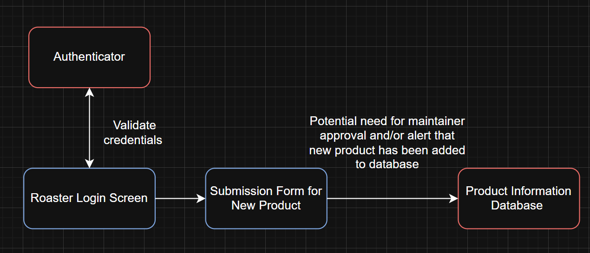

**Component Diagram for Use Case 1:**

----------------- Components in Diagram -----------------

**Match-Making Questionnaire / Front End:**

<u>What it does:</u>

An interface for the user to interact with and answer questions regarding their coffee preferences 

<u>What input it requires:</u>

None

<u>What outputs it provides:</u>

Results of the questionnaire in a structured format (Type: Dictionary)

**Match-Making Algorithm:**

<u>What it does:</u>

Takes the results from the questionnaire and determines appropriate matches. Then returns matches and information about the matches to the results screen.

<u>What input it requires:</u>

- Results of the questionnaire (Type: Dictionary)
- Product information from Product Information database (Type: DataFrame)
- Product information from Reviews and Tasting Notes Database (Type: DataFrame)

<u>What outputs it provides:</u>

Matches and information about the matches in a structured format (Type: List of Dictionaries)

**Product Information Database:**

<u>What it does:</u>

Stores information related to the product such as price, roast level, and other specifications.

<u>What input it requires:</u>

Product name, if being queried (Type: String)

<u>What outputs it provides:</u>

Queried information (Type: DataFrame)

**Reviews and Tasting Notes Database:**

<u>What it does:</u>

Stores information related to the product including tasting notes and reviews left by users

<u>What input it requires:</u>

Product name, if being queried (Type: String)

<u>What outputs it provides:</u>

Queried information (Type: DataFrame)

**Results Screen:**

<u>What it does:</u>

Displays the matches found for the user and information about those matches 

<u>What input it requires:</u>

Matches found; information about matches and reviews if applicable (Type: List of Dictionaries)

<u>What outputs it provides:</u>

None

---

**Component Diagram for Use Case 2:**

----------------- Components in Diagram -----------------

**Roaster Login Screen:**

<u>What it does:</u>

Interface for roasters or admins to log into the system to update the database

<u>What input it requires:</u>

- Username (Type: String)
- Password (Type: String)

<u>What outputs it provides:</u>

- Username (Type: String)
- Password (Type: String)

**Authenticator:**

<u>What it does:</u>

Verify user is known and password is correct 

<u>What input it requires:</u>

- Username (Type: String)
- Password (Type: String)

<u>What outputs it provides:</u>

Authentication result (Type: Boolean)

**Submission Form:**

<u>What it does:</u>

Allows for a verified admin to add additional product information to the database

<u>What input it requires:</u>

Product information from the user in a structured format (Type: DataFrame or CSV likely)

<u>What outputs it provides:</u>

New product entry (Type: DataFrame row) 

