# User Examples

To start the CoffeeMatch application retail online users enter "streamlit run app.py" from the root directory of the repository.

Below, we show the default landing settings.

### Default landing page settings.
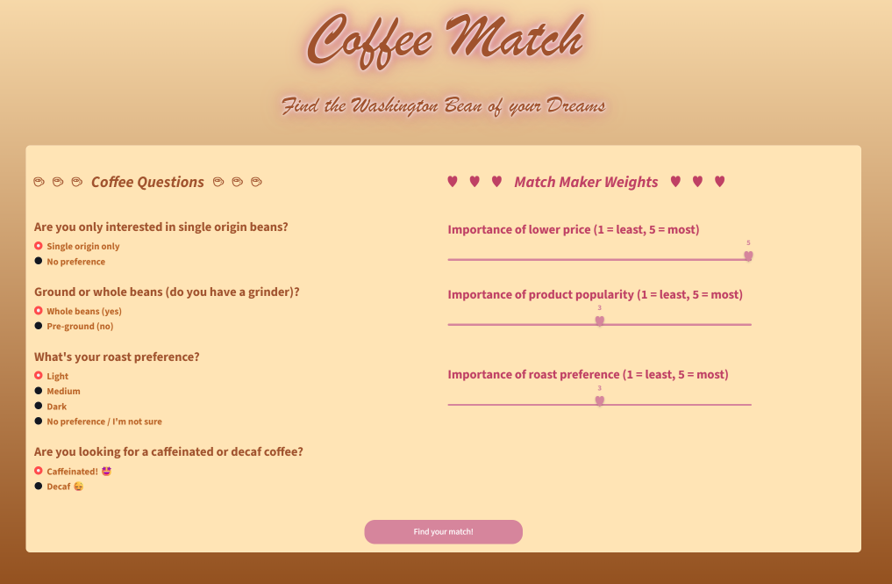

## User Story 1

As a reminder our use case 1 was as follows: “Alex and Kim recently moved to Seattle and they want to gain introduction to a local roasted coffee bean that suits their liking. They’re willing to answer preferential questions in exchange for being matched with the “right” local roaster. They need to learn about the distinguishing aspects of different coffees during the process to have confidence in the resulting match, incorporating some cost considerations. They’re app savvy and online.”

### Step1

We’re going to test this first, by the following selections on the left hand “Coffee Questions”:
- Select 'No preference' for “single origin beans?”
- Leave as default ‘Whole’ for “Ground or whole beans”
- Select ‘Dark’ for “roast preference”
- Select ‘Decaf’ for “Are you looking for a caffeinated or decaf coffee?”

Let’s assume that Alex and Kim lean towards dark blends because that’s what their familiar with, but their open to new possibilities. We’ll also assume they want to leverage the app's understanding of market preferences. 

Combining with their price sensitivity, for the “Match Maker Weights” on the right we assume they select slider bars showing that:
- Price is very important (5). 
- They move the product popularity to (4)
- Roast preference to (1) as depicted below.

Thus the landing screen is set up as below.

### Adjustment to landing settings
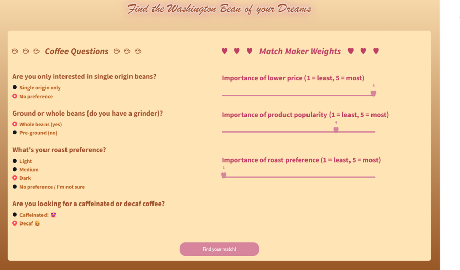

After clicking the button at the bottom "Find your match!" the following screen appears

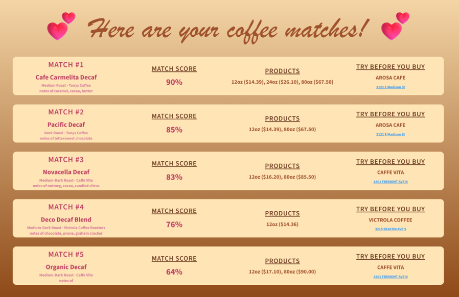

### Step2

We expect that Alex and Kim are primarily interested in the single “top” match, which we can see is Tony’s “Cafe Carmelita Decaf” – having caramel, cocoa, and butter tasting notes with a “MATCH SCORE” of 90%. A quick peruse helps Alex and Kim realize that a 12 oz bag is only $0.03 more expensive than the cheapest on the page “Deco Decaf.” However, it’s a Medium – not dark – so now Alex and Kim can think about whether they’ll make this their match.

To learn more, they hover over the MATCH SCORE and realize that the “Strong value” and “Strong popularity” drove the app to present this as the first option, despite the beans being a little less roasted than Alex and Kim were initially thinking.

### Hover Cafe Carmelita Decaf
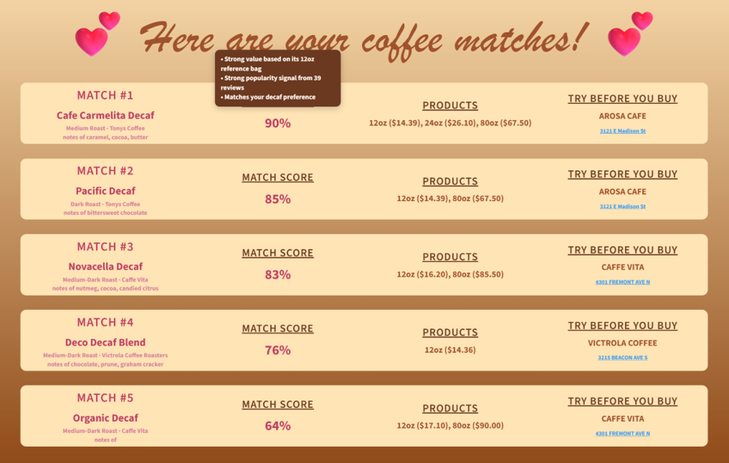

But should they wish to review others on the page hovering over the second best match – Tony’s Pacific Decaf – they can see that this is a dark blend at a similar value but it lacks the depth of reviews.

### Hover Pacific Decaf
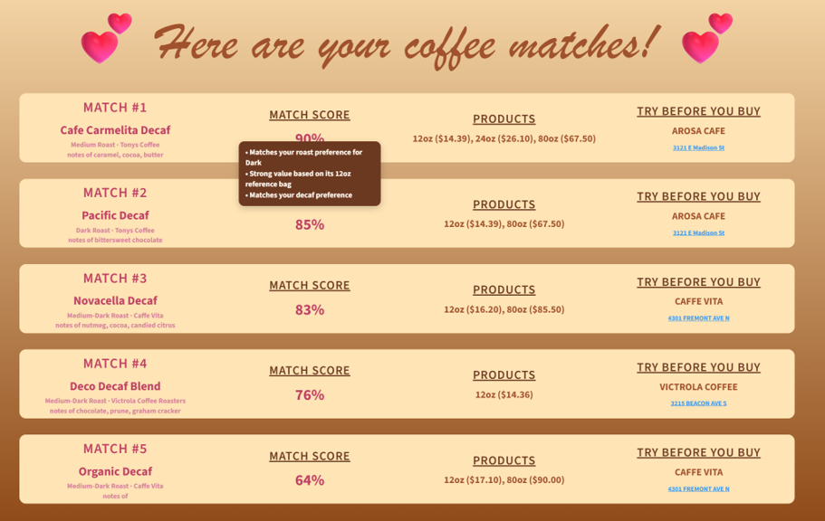

### Step3

Now, Alex and Kim realize that both of the top recommendations come from Tony’s, and they could decide to order 1-2 bags online. But if they wanted to try at a café, the right-hand column offers a blue fonted address for AROSA CAFÉ where they could seek to try both these coffees personally. Clicking on this address would show the café on google maps. They might want to call ahead to find a day that AROSA is serving both. But perhaps ordering online is easier.

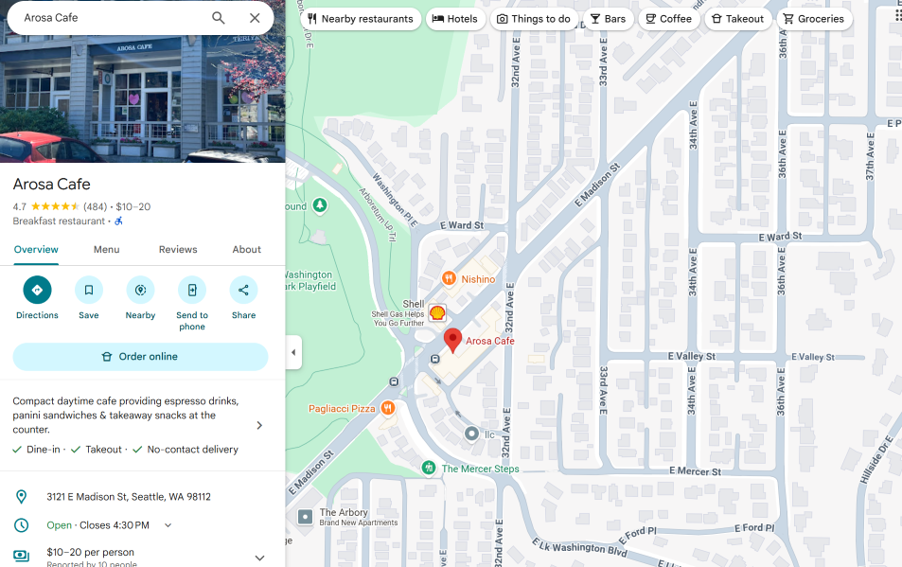

## User Story 2

As a reminder our use case 2 was as follows: "Chris has been changing their normal breakfast routine and wanted to support local businesses at the farmer’s market etc. Chris wants to have some coffees in mind for next Sunday when the market occurs or they visit cafes with friends. One of the reasons Chris attends the farmers market is for the great variety so they appreciate a tool that provides a few different matches and ideas for cafe meeting spots. They appreciate the novelty of exploring new options. They might even want to follow up on the app while they are at the market to ensure the coffees that they see are the ones they are seeking. They are non-technical and would appreciate a simple interface, a variety of options from the match, and a result that would be easy to save and consult."

Chris wants to explore and we'll assume an interest in medium roasted beans but emphasis on little else, which hopefully has a lot of variety.

### Step1

We’re going to test this clicking the following selections on the left hand “Coffee Questions”:
- Leave at default ‘Single origin only’ for “single origin beans?”
- Leave as default ‘Whole’ for “Ground or whole beans”
- Select ‘Medium’ “roast preference”
- Leave at default of ‘Caffeinated’ for “Are you looking for a caffeinated or decaf coffee?”

Let’s assume that Chris wants to explore regardless of price wants to find the less popular with little concern for roast. So for the “Match Maker Weights” on the right we assume they select that 
- Price is least important (1)
- Chris moves the product popularity to (1)
- The roast preference to (1) as depicted below.

Thus the landing screen is set up as below.

### Adjustment to landing settings
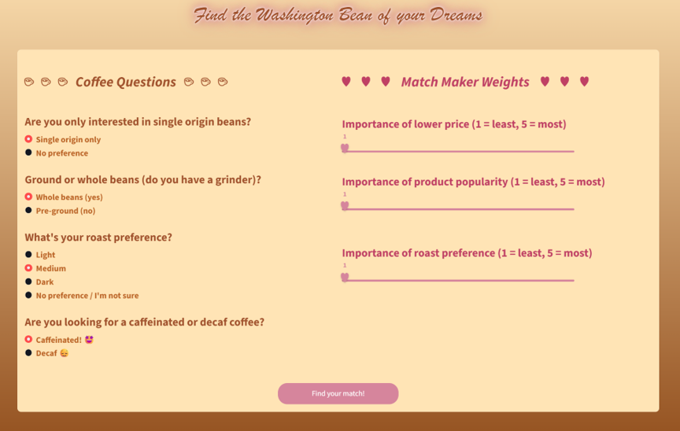

After clicking the button at the bottom "Find your match!" the following screen appears

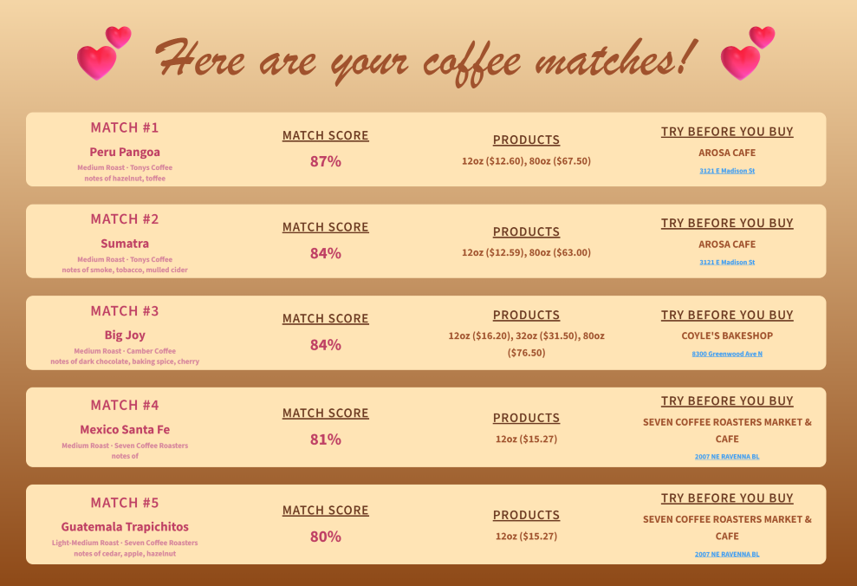

Again Tony’s tops the list, with it’s Peru Mango and Seven takes fifth with its Guatemala Trapichitos. We’ll expore only these options here, but Chris would likely investigate at least one coffee from each of the three roasters shown.

Now Chris likely wants to review all the coffees shown, note their MATCH SCORES ranging from 80-87% which is lower than the prior example. We see five medium roast products from three different roasteries with 12 oz bag prices ranging from $12.59 -16.20.

### Step2

Chris uses the MATCH SCORE hover tool tip to find out that “roast preference” and “single origin” contributed to each of these coffees coming out on the recommendation list of five coffees. Chris also might see that Guatemala Trapichitos has over 100 strong reviews.

### Hover Peru Mango
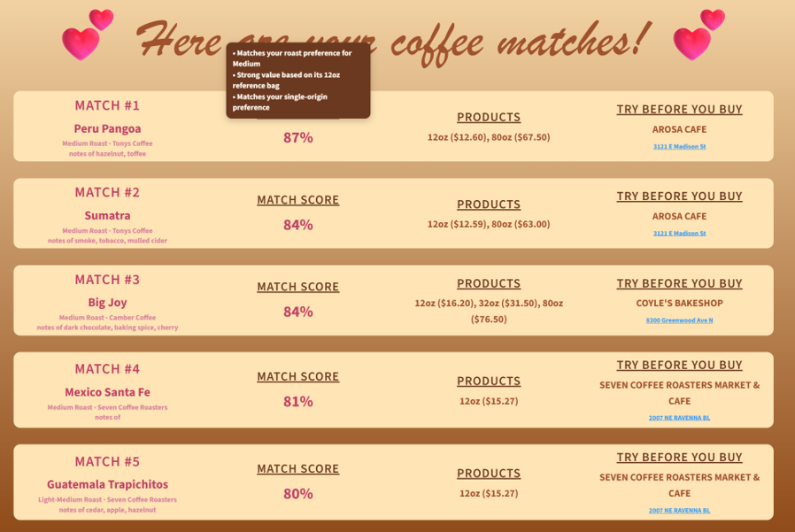

### Hover Guatemala Trapichitos
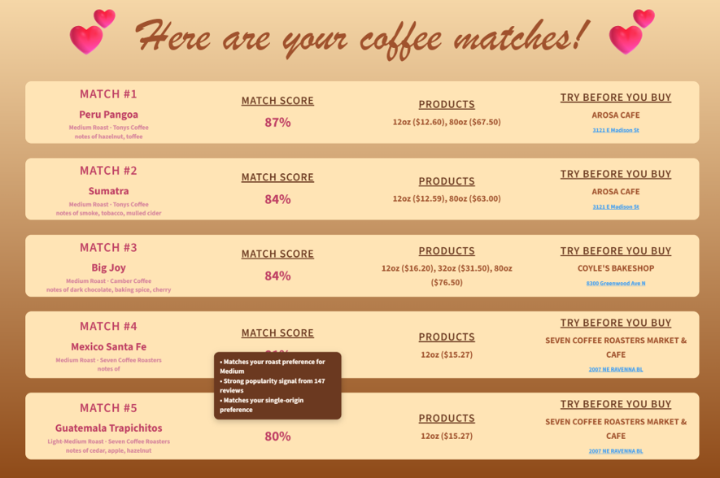

### Step3

Chris will most likely want to try these coffees and more at a café so the right-hand column offers the address for SEVEN COFFEE ROASTERS MARKET & CAFE AROSA CAFÉ where they could seek to try both these coffees personally. After reviewing the google maps link, Chris might plan a trip to seven for a weekend at the University District and a trip to Arosa after a walk in the Arboretum.

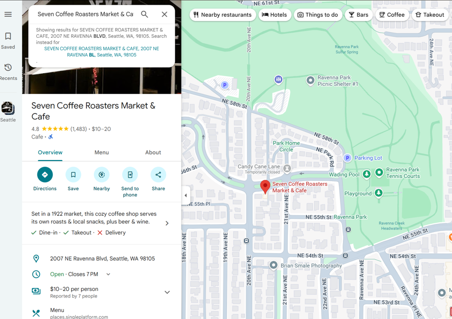

## User Story 3

As a reminder our use case 3 was as follows: "Java might be considered a coffee expert. She likes to sample many local coffees. And while other people’s rankings are considered, her testing is the most important. She might occasionally share sommelier-like opinions on social media, revealing the coffee’s packaging. Online ordering can save her time, and she doesn’t want to miss the roaster's newest product offerings, so punctuality of product listing is key for her and she might even anticipate new releases. She has excellent mobile application skills, and may have “tech” skills as well."

## Start

As a coffee expert Java might use this product many ways – including those already captured – perhaps flexing the extremes of different roast and price themes looking for new products which have not had a chance to become popular yet. Java is probably familiar with café locations and less concerned about why the app is recommending something but more concerned about what is recommended.

We’re going to test this clicking the following selections on the left hand “Coffee Questions”:
- Leave at default ‘Single origin only’ for “single origin beans?”
- Leave as default ‘Whole’ for “Ground or whole beans”
- Leave as default ‘Light’ “roast preference”
- Leave at default of ‘Caffeinated’ for “Are you looking for a caffeinated or decaf coffee?”

Sliders
- Price is least important (1)
- Product popularity to least (1)
- The roast preference to (5) as depicted below

### Adjustment to landing settings
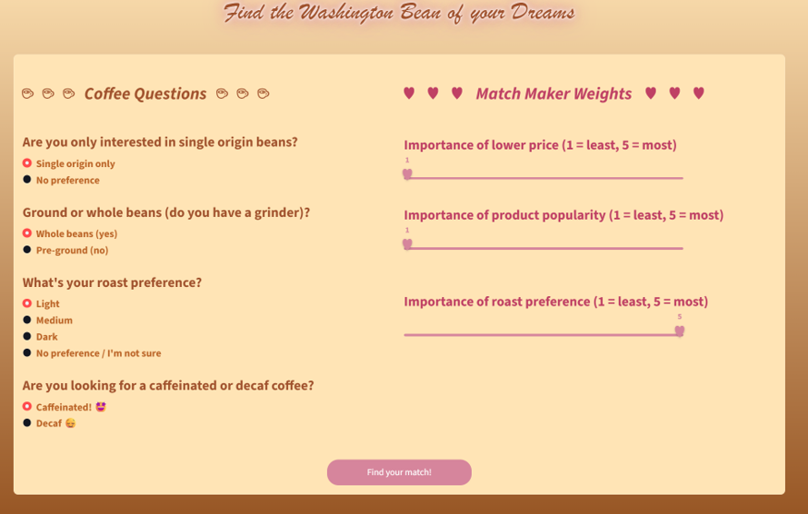

After clicking the button at the bottom "Find your match!" the following screen appears

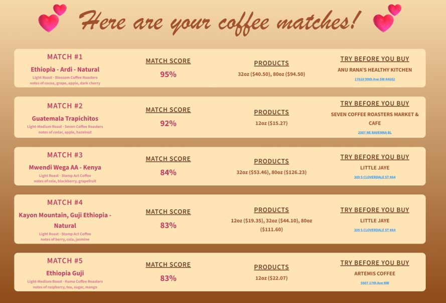

That’s some really expensive coffee, with match #3 and #5  – the Mwendi Wega AA Kenya and the Ethiopia Guji – both costing more than $20 per 12 oz bag. But we can see the smallest package of Mwendi Wedge available is a two lbs bag. At this point Java might be intrigued by this option. And investigation of MATCH SCORE would show that neither has strongly supporting reviews - hover not shown - so far. Yet Java might want to keep Stamp Act and Kuma roasteries – as well as the top matching Blossom on her radar for lighter African origin roasts.

## User Story 4

Use story 4 involved allowing the addition of new coffees and roasteries to the database during an interaction between the app - and potentially its maintainers - and the roasteries. This case remains in our next steps so we cannot demonstrate it at this time.

